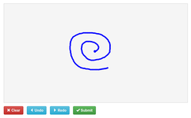
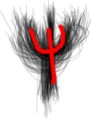
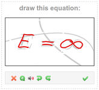
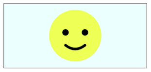

# jSketch

A lightweight JavaScript library for drawing facilities on an HTML5 canvas.
Conveniently wrapped in a `Sketchable` class.
Available also as a jQuery plugin.

**Disclaimer:** This library is mainly focused on free-form drawing,
although it supports many of the native canvas methods.
If you need a more complex solution try [RaphäelJS](http://www.raphaeljs.com)
or [Fabric.js](http://www.fabricjs.com)

[Demos and documentation](https://luis.leiva.name/jsketch/)







## TL;DR:

### Vanilla JavaScript version
Add `<script src="dist/sketchable.full.min.js"></script>` to your page and just do:
```js
var sketcher = new Sketchable('canvas');
```

### jQuery version
Add `<script src="dist/jquery.sketchable.full.min.js"></script>` to your page and just do:
```js
var $sketcher = $('canvas').sketchable();
```

That's it!

**Want to know more?**
Go to [demos and documentation](https://luis.leiva.name/jsketch/).

## License

This libray is released with the [MIT license](LICENSE).
The only requirement is that you keep my copyright notice intact when you repurpose, redistribute, or reuse this code.
